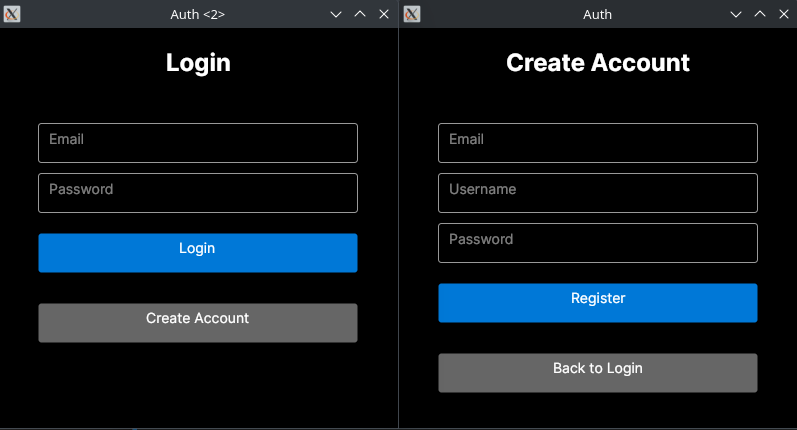

# Chat Application
A real-time chat application built with C# and Firebase as the backend. Personal project for learning purposes.

## Overview
This application enables users to communicate with all registered users in real time. Users can start conversations with a specific user or connect with a random one.

## Features
- **Firebase authentication**
- **Real-time messaging** - send and receive messages in real time
- **New message indicators** - unread messages from other users are highlighted
- **User status tracking** - see when other users appear online or go offline in real time
- **Random chat matching** - connect with a random user and start a conversation
- **Cross-platform support**
- **Modern UI** - built with Avalonia UI Framework

### Architecture
The application follows the MVVM (Model-View-ViewModel) design pattern. However, models are in process of being separated from the view models.

### Technologies
- C# (.NET)
- Avalonia UI framework
- Firebase Realtime Database
- ReactiveUI

## Showcase

### Login And Registration

### User status tracking (online/offline)

### Messaging

### New Message Indicator

### Future improvements
- Separating models to further improve the architecture
- Group chat
- Search users

### License
This project is licensed under the GNU General Public License v3.0. See the [LICENSE](LICENSE) file for details.